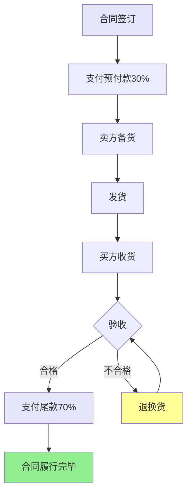

# Mermaid业务流程图规范

从合同文本提取完整交易流程，生成Mermaid流程图并渲染为PNG图片。

**语言规则**：使用合同的主要语言编写节点文字和标签。详见 [language.md](language.md)

---

## 提取要求

### 1. 流程完整性
- 覆盖从合同签订到履行完毕的完整生命周期
- 包含正常履行、违约处理、合同终止等分支
- 展示双方互动、权利义务关系

### 2. 信息精确性
- **时间点**：提取明确的时间要求（如X个工作日、X小时内）
- **金额**：提取金额和比例（如30%预付款、总金额）
- **数量/规格**：提取数量、型号、技术规格
- **地点**：交付/验收地点
- **标准**：验收标准、质量要求、技术规格
- **严格来源**：所有提取数据必须来自合同文本

### 3. 节点格式
- 每个节点使用方括号 `[]`
- 使用 `<br>` 换行分隔多个项目
- 边标签显示触发条件/时间要求：`|条件|`；缺失时用 `?`

### 4. 流程逻辑
- 使用 `-->` 表示正常流程
- 包含决策分支（如验收通过/不通过）
- 包含并行流程（如风险转移与所有权转移）
- 展示违约后果的升级路径（轻微→严重→终止）

### 5. 视觉样式
在代码末尾添加样式：
- 正常履行节点：`style [nodeId] fill:#e6e6fa`
- 违约相关节点：`style [nodeId] fill:#ffff99`
- 终止节点：`style [nodeId] fill:#ff6666`
- 正常完成节点：`style [nodeId] fill:#90ee90`

---

## 输出格式

- **仅输出** Mermaid代码，以 `flowchart TD` 开头
- 不包含额外说明或代码围栏
- 语法必须正确可渲染

---

## 渲染命令

```bash
mmdc -i flow.mmd -o flow.png -t neutral
```

如未安装 `mmdc`，仅生成 `.mmd` 文件（无PNG图片）

---

## 示例（中文合同）



---

## 关键节点类型

| 节点类型 | 说明 | 示例 |
|---------|------|------|
| 开始节点 | 合同生效/签订 | 合同签订生效 |
| 付款节点 | 各阶段付款 | 支付预付款30%<br>支付进度款40% |
| 交付节点 | 货物/服务交付 | 卖方发货<br>服务提供完成 |
| 验收节点 | 检验/确认 | 买方验收<br>验收期限：7日 |
| 决策节点 | 条件分支 | 验收是否合格 |
| 违约节点 | 违约处理 | 逾期付款<br>违约金：日万分之五 |
| 终止节点 | 合同结束 | 合同解除<br>履行完毕 |
