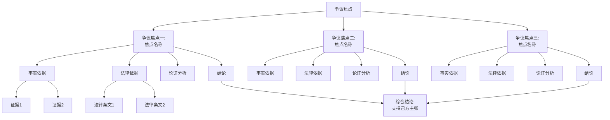

# 【案件名称】一审代理词

---

## 首部

**致**：XXX人民法院

**案号**：

**案由**：

**代理律师**：
- 姓名：
- 执业机构：
- 执业证号：

---

## 前言

依照法律规定，广东广和（长春）律师事务所接受XXXX的委托，指派本律师担任本案【X诉X纠纷案】一审的诉讼代理人，参与本案的诉讼活动。

本案已于【开庭日期】开庭审理。庭审中，法庭归纳了本案的争议焦点，各方围绕争议焦点进行了举证、质证和法庭辩论。现根据庭审中查明的事实、法庭归纳的争议焦点以及各方发表的辩论意见，结合相关法律规定，发表如下代理意见，供法庭参考。

---

## 正文

### 争议焦点一：【焦点名称】

#### （一）事实依据

【根据庭审中查明的事实，结合证据材料，陈述与本案争议焦点相关的事实】

**证据支持**：
- 证据【编号】：【证据名称】，证明【证明内容】（见证据第X页）
- 证据【编号】：【证据名称】，证明【证明内容】（见证据第X页）

#### （二）法律依据

【引用与本案争议焦点相关的法律法规条文】

1. 【法律名称】第X条：【条文内容】
2. 【司法解释/法规名称】第X条：【条文内容】

#### （三）分析论证

【运用三段论逻辑结构，以法律规范为大前提，以案件事实为小前提，进行法律分析论证】

1. 【论证要点一】
   - 
   - 

2. 【论证要点二】
   - 
   - 

3. 【针对对方观点的反驳】（如适用）
   - 对方观点：
   - 反驳理由：

#### （四）结论

综上所述，关于【争议焦点一】，【结论内容】。

---

### 争议焦点二：【焦点名称】

#### （一）事实依据

【根据庭审中查明的事实，结合证据材料，陈述与本案争议焦点相关的事实】

**证据支持**：
- 证据【编号】：【证据名称】，证明【证明内容】（见证据第X页）
- 证据【编号】：【证据名称】，证明【证明内容】（见证据第X页）

#### （二）法律依据

【引用与本案争议焦点相关的法律法规条文】

1. 【法律名称】第X条：【条文内容】
2. 【司法解释/法规名称】第X条：【条文内容】

#### （三）分析论证

【运用三段论逻辑结构，以法律规范为大前提，以案件事实为小前提，进行法律分析论证】

1. 【论证要点一】
   - 
   - 

2. 【论证要点二】
   - 
   - 

3. 【针对对方观点的反驳】（如适用）
   - 对方观点：
   - 反驳理由：

#### （四）结论

综上所述，关于【争议焦点二】，【结论内容】。

---

### 争议焦点三：【焦点名称】（如有更多争议焦点，依此类推）

#### （一）事实依据

#### （二）法律依据

#### （三）分析论证

#### （四）结论

---

### 其他需要说明的问题（如有）

【针对庭审中法官关注但未纳入争议焦点的问题，或需要特别说明的程序问题等】

---

## 结语

综上所述，本案【总结核心观点】。

代理人认为：
1. 【核心观点一】
2. 【核心观点二】
3. 【核心观点三】

因此，【提出具体的诉讼请求或答辩主张，请求法庭予以支持】。

以上代理意见，恳请法庭采纳。

---

**此致**

**XXX人民法院**

---

**代理人**：

**执业机构**：

**日期**：    年    月    日

---

## 附件

1. 证据目录
2. 法律法规汇编（如有）
3. 案例检索报告（如有）
4. 代理思维导图

---

## 代理思维导图（Mermaid格式）

---

**提交日期**：庭审后第【 】日提交

**备注**：本代理词根据【开庭日期】庭审情况撰写，如有补充意见将另行提交。

