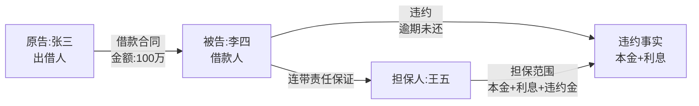
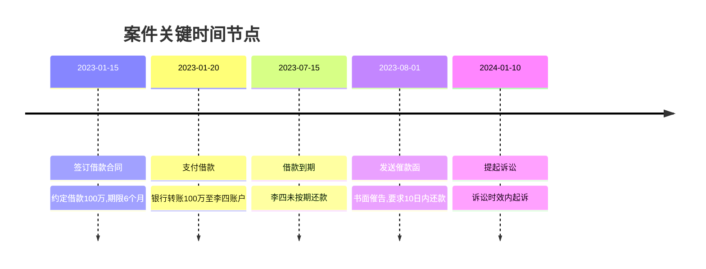
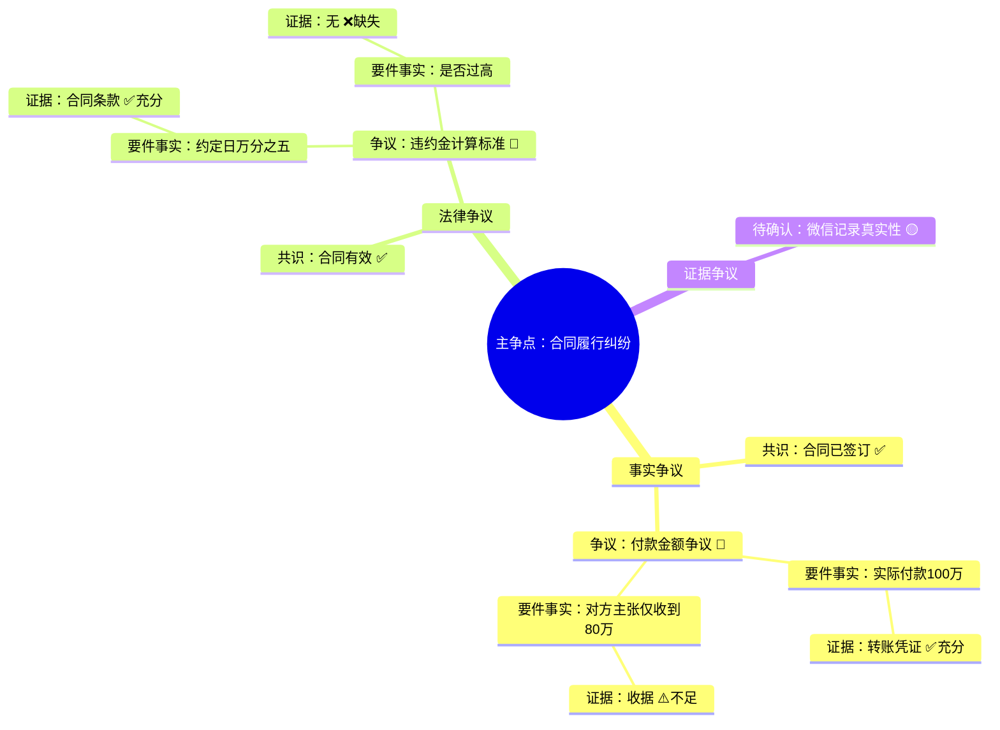
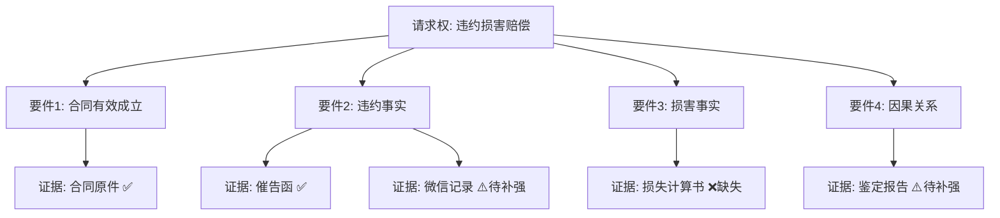
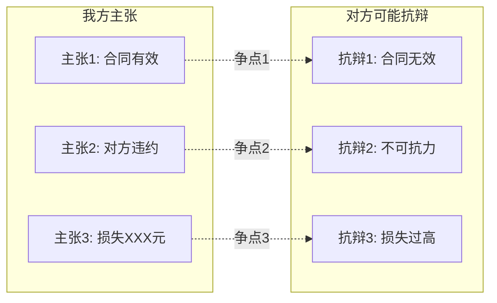
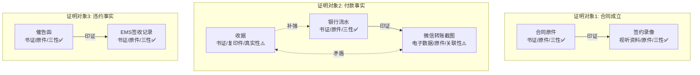

# 六类Mermaid图表完整说明

> **来源**: 诉讼可视化Skill - 第二部分：图表类型说明
> **用途**: 详细描述6种诉讼可视化图表的用途、Mermaid语法示例和标注规范

---

## 2.1 法律关系图（flowchart）

使用 flowchart 语法展示当事人之间的法律关系：

**图表要素：**
- 各方当事人及其法律地位
- 法律关系类型及核心内容
- 权利义务流向
- 关键金额、期限等要素

## 2.2 法律事实时间图（timeline）

使用 timeline 语法展示案件关键时间线：

**图表要素：**
- 关键时间节点
- 对应事件描述
- 与诉讼时效的关系提示

## 2.3 争点树（mindmap）

将争议焦点以树形结构展示，按层级标注状态：

**节点状态标注：**
- 共识要件（双方无争议）→ ✅ 绿色
- 争议要件（双方有分歧）→ 🔴 红色
- 待确认要件 → 🟡 黄色
- 证据状态：✅充分 / ⚠️不足 / ❌缺失

## 2.4 要件分析图（graph TD）

展示请求权→构成要件→要件事实→证据支撑的层级关系：

**要件状态标注：**
- ✅ 满足（证据充分）
- ⚠️ 待证（证据不足，需补强）
- ❌ 不满足（证据缺失）

## 2.5 攻防对抗图（graph LR）

左右对照结构展示我方主张与对方可能抗辩：

**图表要素：**
- 左侧：我方主张（基于请求权基础）
- 右侧：对方可能抗辩（基于抗辩权分析）
- 中间连线：标注争议焦点编号

## 2.6 证据链图谱（graph TD）

按证明对象分组，展示证据之间的关系：

**证据节点信息：**
- 证据名称
- 证据类型（书证/物证/视听资料/电子数据/证人证言）
- 原件状态（原件/复印件）
- 三性评价（✅通过 / ⚠️存疑 / ❌不通过）

**关系类型：**
- 实线箭头 `-->|印证|`：多个证据指向同一事实
- 虚线箭头 `-.补强.->`：一个证据增强另一证据的证明力
- 红色双向虚线 `<-.矛盾.->`：两个证据互相矛盾
