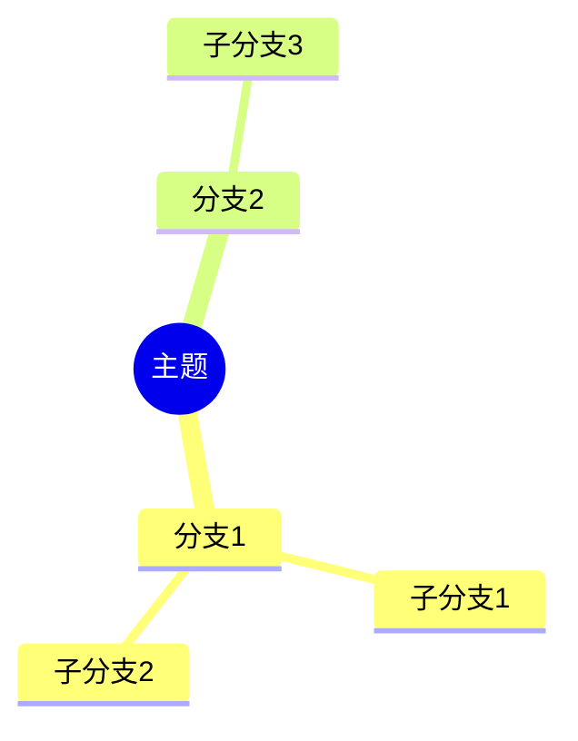

# 图表排版规范

> **来源**: 诉讼可视化Skill - 第四部分：排版与嵌入规范
> **用途**: 规定Mermaid图表的处理方式、Word文档嵌入规则和格式要求

---

## 4.1 Mermaid图表处理

**图片交付强制规则：**
- 所有法律图表必须生成可直接查看的图片，优先 `.png`，复杂图可同时保留 `.svg`。
- `.mmd` 只作为可编辑源码和版本记录，不得作为客户或法官查看的唯一成果。
- Word、飞书文档和正式报告中必须嵌入图片，不直接嵌入 Mermaid 代码。

**双格式导出：**
- 每个Mermaid图表同时导出 `.mmd` 源文件和 `.png` 图片
- `.mmd` 文件供后续编辑和版本管理
- `.png` 文件用于Word文档嵌入

**Word文档嵌入规则：**
- Word文档中**仅嵌入PNG图片**，不嵌入Mermaid代码
- 每张图表后配1段说明文字（2-3句，解释图表要点）
- 图表编号：图1、图2...（全文连续编号）

**可读性检查：**
- 单张图原则上不超过25个节点；超过时拆成多图。
- 每个节点尽量控制在2行短句内，不把长段事实塞进节点。
- 图中必须有清晰标题、方向和分组；金额、日期、主体名称优先保留，解释性文字放到图后说明。
- 渲染后如出现拥挤、重叠、断字、方向混乱，必须改图型或拆图后重新导出。

## 4.2 思维导图与替代图型

一般层级结构可以用 Mermaid 的 mindmap 语法呈现：

争点结构图无论简单或复杂，均不使用 mindmap，统一使用树状图/分层争点图。其他图表若分支超过4层、节点超过25个、节点文字较长或需要展示时间/主体/金额流向，应改用：

- 树状图：适合争点、要件、证明对象。
- 泳道图：适合多主体、多阶段的事实经过或维权过程。
- 分组流程图：适合资金流向、程序推进、合同履行过程。
- 多张专题图：适合将“事实经过、金额流向、人物关系、证据链”分别展示。

## 4.3 排版格式规范

| 元素 | 格式要求 |
|-----|---------|
| 纸张 | A4纵向，页边距上下2.54cm、左右3.18cm |
| 文档标题 | 华文中宋小二号加黑，居中 |
| 一级标题 | 黑体三号 |
| 二级标题/图表标题 | 黑体小三号 |
| 正文/说明文字 | 宋体小四，1.5倍行距 |
| 表格内容 | 宋体五号 |
| 图表编号 | 图1、图2...（全文连续编号） |
