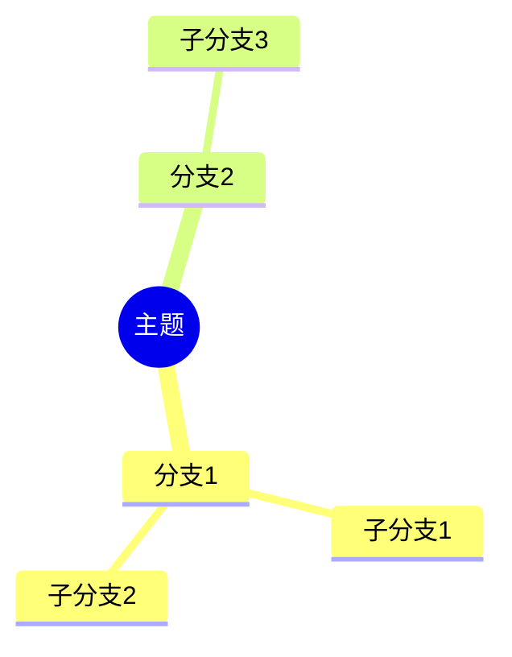

# 图表排版规范

> **来源**: 诉讼可视化Skill - 第四部分：排版与嵌入规范
> **用途**: 规定Mermaid图表的处理方式、Word文档嵌入规则和格式要求

---

## 4.1 Mermaid图表处理

**双格式导出：**
- 每个Mermaid图表同时导出 `.mmd` 源文件和 `.png` 图片
- `.mmd` 文件供后续编辑和版本管理
- `.png` 文件用于Word文档嵌入

**Word文档嵌入规则：**
- Word文档中**仅嵌入PNG图片**，不嵌入Mermaid代码
- 每张图表后配1段说明文字（2-3句，解释图表要点）
- 图表编号：图1、图2...（全文连续编号）

## 4.2 思维导图支持

争点树、要件分析等适合用Mermaid的mindmap语法呈现：

## 4.3 排版格式规范

| 元素 | 格式要求 |
|-----|---------|
| 纸张 | A4纵向，页边距上下2.54cm、左右3.18cm |
| 文档标题 | 华文中宋小二号加黑，居中 |
| 一级标题 | 黑体三号 |
| 二级标题/图表标题 | 黑体小三号 |
| 正文/说明文字 | 宋体小四，1.5倍行距 |
| 表格内容 | 宋体五号 |
| 图表编号 | 图1、图2...（全文连续编号） |
