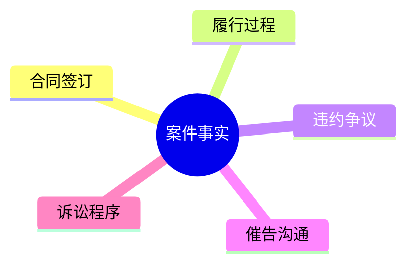

# 时间线与飞书思维导图

本地系统记录是事实源，飞书文档或画板是展示视图。

## 本地时间线

### 事实时间线

记录案情本身发生了什么：

```markdown
| 日期 | 事实 | 证明材料 | 来源 | 有利/不利/中性 | 存疑 |
|---|---|---|---|---|---|
```

### 程序时间线

记录案件程序如何推进：

```markdown
| 日期 | 程序事件 | 机关/法院 | 文件 | 影响 | 下一步 |
|---|---|---|---|---|---|
```

刑事案件程序时间线应额外关注：侦查、批捕、移送审查起诉、起诉、一审、二审、再审、羁押状态、会见、阅卷、认罪认罚、特殊程序。

## 飞书思维导图

适用图：

- 事实时间线思维导图。
- 程序进展思维导图。
- 证据链思维导图。
- 争议焦点思维导图。
- 刑事阶段路线图。

流程：

1. 从 `事实时间线.md`、`程序时间线.md`、`材料清单.md` 提取节点。
2. 使用 Mermaid 生成 `mindmap`、`timeline` 或 `flowchart`。
3. 使用 `lark-doc` 创建或更新飞书文档。
4. 如需要飞书画板，使用 `lark-whiteboard`；覆盖已有画板前必须按其规则 dry-run 并确认。
5. 将飞书链接写入 `飞书同步记录.md`。

## Mermaid 示例


